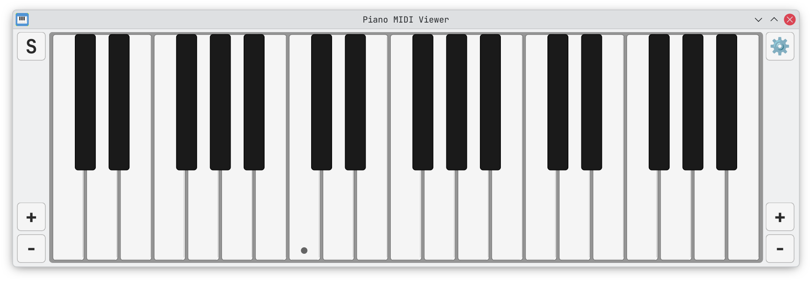
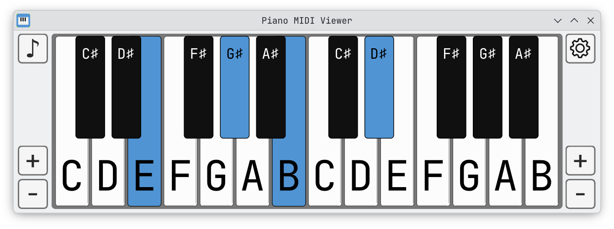
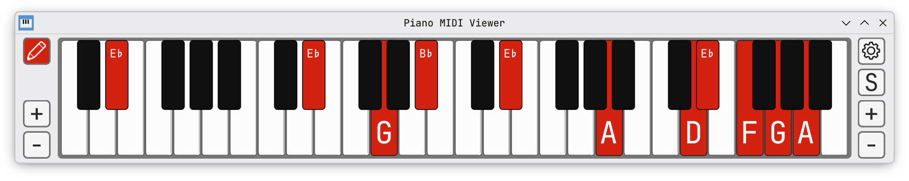
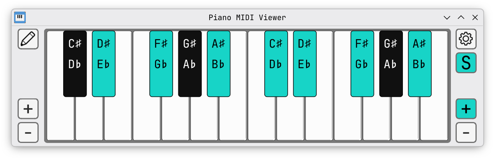
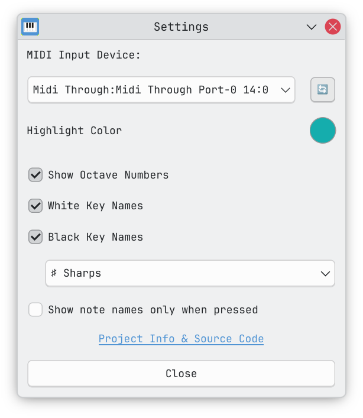

# Piano MIDI Viewer

A piano keyboard on your screen that lights up when you play. Made for music teachers, students, and streamers.


## Features

- 🎹 **MIDI input** — connect your digital piano or MIDI keyboard and see which keys you press in real time; devices are detected automatically when plugged in
- 🖱️ **Mouse support** — click on any key to highlight it, drag across keys to glide
- ✏️ **Pencil tool** — press P or toggle the pencil tool to start marking keys; left-click to mark, right-click to erase, press Esc to exit
- 🔠 **Key labels** — show or hide note names, octave numbers, sharps and flats
- 👇 **Show on press** — only show labels on keys that you are currently pressing
- 🎨 **Custom colors** — pick any highlight color; text adjusts automatically so it's always easy to read
- 🎵 **Sustain indicator** — the S button lights up when your MIDI sustain pedal is held
- ↔️ **Octave range** — use the + and − buttons to show more or fewer octaves (from A0 up to C8)

## Screenshots



*Default look*



*Arch Blue, 2 octaves, showing sharps*



*Red, pencil tool active, 4 octaves, flats, labels only on pressed keys*



*Teal, both sharps and flats, no white key names*

### Settings



*MIDI device, colors, and display options*

## Download

Go to [Releases](https://codeberg.org/skoomabwoy/piano-midi-viewer/releases) and download the app for your system. **No installation needed** — just download and run.

### Windows

1. Download **PianoMIDIViewer.exe**
2. Double-click the file to open it

> If Windows shows a "Windows protected your PC" warning, click **More info** → **Run anyway**. This happens because the app is not signed with a Microsoft certificate — but it is still safe to run.

### macOS

1. Download **PianoMIDIViewer.app.zip**
2. Double-click the zip file to unzip it
3. Right-click **PianoMIDIViewer.app** and choose **Open**

> If macOS shows a warning that the app "can't be opened", follow these extra steps (only needed once):
>
> 4. Open **Terminal** (press `Cmd + Space`, type `Terminal`, press Enter)
> 5. Type "xattr -cr " (with a space at the end), then **drag the PianoMIDIViewer.app icon into the Terminal window** — this will add a path to the folder with the app
> 6. Press Enter
> 7. Now right-click the app again and choose **Open**
>
> This happens because the app is not signed with an Apple certificate — but it is still safe to run.


### Linux

1. Download **PianoMIDIViewer**
2. Right-click the file → Properties → Permissions → check **"Allow executing as program"**
3. Double-click the file to open it

Or if you prefer the terminal:
```bash
chmod +x PianoMIDIViewer
./PianoMIDIViewer
```

<details>
<summary><b>Alternative: Run from source (for power users)</b></summary>

Requires Python 3.8+:

```bash
git clone https://codeberg.org/skoomabwoy/piano-midi-viewer.git
cd piano-midi-viewer
python -m venv venv
source venv/bin/activate
pip install -r requirements.txt
python piano_viewer.py
```

</details>

## Technical Details

| | |
|-|-|
| Architecture | Single file (`piano_viewer.py`, ~2300 lines) |
| Framework | PyQt6, python-rtmidi |
| Font | JetBrains Mono (embedded) |
| MIDI range | A0–C8 (notes 21–108) |
| Polling | 10ms (100Hz) |

## Changelog

See [releases](https://codeberg.org/skoomabwoy/piano-midi-viewer/releases) for full history.

**8.2.1** — MIDI hot-plug detection, auto-reconnect, version display and update checker in Settings
**8.1.2** — UI scaling (25–200%), P shortcut for pencil tool
**8.1.1** — S button is now a pure indicator (no visual feedback when clicked)
**8.1.0** — Notes highlight only while actively pressed; S button is now a sustain pedal indicator only; pencil tool out-of-range marks now glow the + buttons
**8.0.0** — UX rework: pencil tool, custom drawn cursors (pencil + eraser)
**7.0.0** — Drawing/Playing modes, Mode button with sustain control
**6.3.5** — macOS docs fix (xattr command for Gatekeeper)
**6.3.4** — macOS support, dynamic key gaps, cross-platform fixes
**6.3.3** — Adaptive button text color (matches note name behavior)
**6.3.2** — OBS integration (octave range & window geometry persistence, visual polish)
**6.3.1** — Cross-platform UI consistency (SVG icons, JetBrains Mono buttons)
**6.3.0** — Linux standalone app (no Python required)
**6.2.0** — Windows standalone .exe
**6.1.0** — Show labels only when pressed
**6.0.0** — Key labels (note names, octaves, accidentals)
**5.0.0** — Mouse support, sustain modes

## License

GPL-3.0 — See [LICENSE](LICENSE)

## Development

See [CLAUDE.md](CLAUDE.md) for architecture docs.

---

Contributions welcome.
