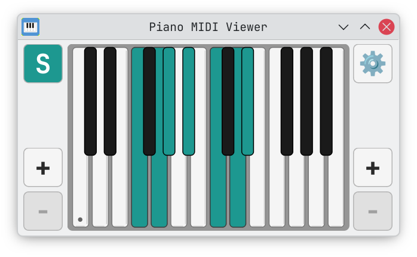
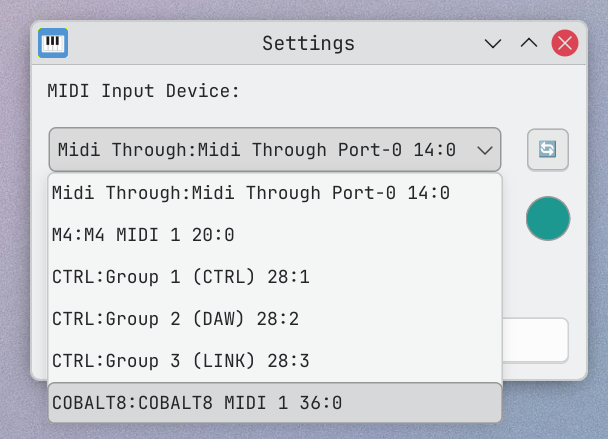

# Piano MIDI Viewer

A visual piano keyboard that displays MIDI input in real-time. Perfect for music education and online lessons via OBS.


## Features

- 🎹 **Real-time MIDI input display** - See notes as you play
- 🎨 **Customizable highlight color** - Choose your preferred color scheme
- 🎵 **Sustain pedal support** - Recognizes MIDI CC 64 messages
- 🖱️ **Mouse interaction** - Click keys or drag for glissando effects
- ⌨️ **Shift key sustain** - Hold Shift to sustain notes
- 📊 **Dynamic range** - Display 3-7 octaves (A0 to C8)
- 🎯 **Smart glissando** - Paint notes (ON mode) or erase notes (OFF mode)
- 🔄 **Out-of-range tracking** - Tracks notes played outside visible range
- ✨ **Clean, minimal UI** - Distraction-free design for streaming

## Screenshots

### Default Interface

*Clean, minimal design with 3-octave keyboard*

### Customizable Colors & Dynamic Range

*Arch Blue theme (default) with sustained notes*


*Custom red highlight color with expanded 4-octave range*


*Teal color theme with resized window*

### Settings Dialog

*Configure MIDI device, highlight color, and resize limits*

## Installation

### Prerequisites

- Python 3.8 or higher
- A MIDI input device (keyboard, controller, or virtual MIDI port)

### Quick Start

1. Clone this repository:
```bash
git clone https://codeberg.org/skoomabwoy/piano-midi-viewer.git
cd piano-midi-viewer
```

2. Create and activate a virtual environment:
```bash
python -m venv venv
source venv/bin/activate  # On Linux/Mac
```

3. Install dependencies:
```bash
pip install -r requirements.txt
```

4. Run the application:
```bash
python piano_viewer.py
```

## Usage

### Basic Controls

- **Settings (⚙️)**: Configure MIDI device, highlight color, and resize limits
- **Sustain (S)**: Click to toggle sustain mode (sticky)
- **+/- buttons**: Add or remove octaves from either end of the keyboard
- **Mouse click**: Click keys to highlight them (toggle with sustain active)
- **Mouse drag**: Glissando effect - drag to paint or erase notes
- **Shift key**: Hold to activate sustain mode temporarily

### Sustain Modes

Sustain can be activated three ways:
- Click the **S button** (sticky toggle)
- Hold the **Shift key** (temporary)
- Press **MIDI sustain pedal** (CC 64, temporary)

When sustain is active:
- Released notes stay highlighted until sustain is released
- Click/play a sustained note again to toggle it off
- S button glows with your chosen highlight color

### Mouse Interaction

**Without sustain:**
- Click and release to briefly highlight a note

**With sustain:**
- Click to toggle notes on/off
- Drag across keys for glissando:
  - Start on empty note → Paint mode (adds notes)
  - Start on highlighted note → Erase mode (removes notes)
- Clicks on gaps between keys snap to the nearest key

## For Streamers (OBS Integration)

This app is designed to be captured via OBS:

1. Add a **Window Capture** source in OBS
2. Select "Piano MIDI Viewer" as the window
3. Right-click → Filters → Add **Chroma Key**
4. Set key color to the grey background (or use Color Key with similarity ~50)
5. Position and resize as needed

The minimal UI keeps focus on the keyboard, perfect for music education streams.

## Configuration

### Resizing Limits

Toggle resizing limits in Settings (⚙️):
- **ON**: Maintains aspect ratio (width 0.1-0.7× height, height 3-10× width)
- **OFF**: Free resize (absolute minimums still enforced)

### Keyboard Shortcuts

- **Shift**: Temporary sustain activation
- **Mouse click**: Toggle notes (with sustain) or momentary highlight (without)
- **Mouse drag**: Glissando paint/erase

## Technical Details

- **Single-file architecture**: Entire app is in `piano_viewer.py` (~1600 lines)
- **Framework**: PyQt6 for GUI, python-rtmidi for MIDI input
- **MIDI range**: A0 to C8 (MIDI notes 21-108)
- **Default display**: C3 to B5 (3 octaves)
- **Polling interval**: 10ms (100Hz MIDI polling)

## Requirements

- PyQt6 >= 6.6.0
- python-rtmidi >= 1.5.0

## Development

See [`CLAUDE.md`](CLAUDE.md) for detailed architecture documentation, code organization, and implementation notes.

## Changelog

### 5.0.1 (2026-01-04)
- Gap clicks now snap to closest key for easier chord clicking
- Highlighted white keys now have visible dark borders
- Darker background grey for better white key contrast
- S button and plus button glows update when highlight color changes

### 5.0.0
- MIDI sustain pedal support (CC 64)
- Mouse click and glissando support
- Shift key sustain activation
- Sustain button with visual indicator
- Out-of-range note tracking
- Error correction (toggle sustained notes off)

## License

GPL-3.0 - See [LICENSE](LICENSE) file for details.

## Contributing

Contributions, bug reports, and feature requests are welcome! Feel free to open an issue or submit a pull request.

## Author

Built for music education and online lessons.

---

**Note**: This project is Linux-focused. Windows support has been removed as of version 5.0.0.
