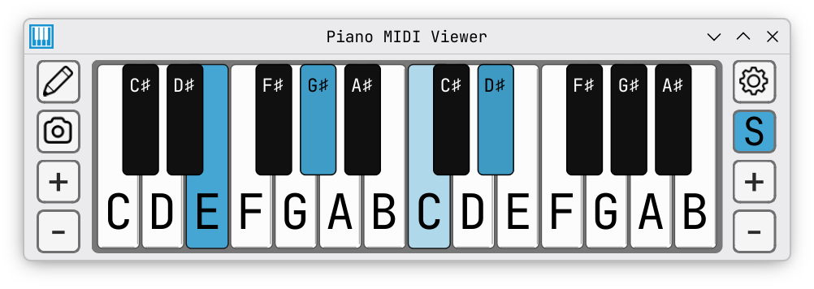
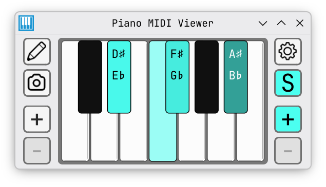

# Piano MIDI Viewer

A piano keyboard on your screen that lights up when you play. Made for music teachers, students, and content creators.


## Features

- 🎹 **MIDI input** — connect your digital piano or MIDI keyboard and see which keys you press in real time; devices are detected automatically when plugged in
- 🖱️ **Mouse support** — click on any key to highlight it, drag across keys to glide
- ✏️ **Pencil tool** — press P or toggle the pencil tool to start marking keys; left-click to mark, right-click to erase, press Esc to exit
- 🔠 **Key labels** — show or hide note names, octave numbers, sharps and flats
- 👇 **Show on press** — only show labels on keys that you are currently pressing
- 🎨 **Custom colors** — pick any highlight color; text adjusts automatically so it's always easy to read
- 🎶 **Velocity sensitivity** — optionally show how hard you press each key (brighter = harder); off by default
- 🎵 **Sustain indicator** — the pedal icon lights up when your MIDI sustain pedal is held
- 🔌 **Auto-detect** — if you have one MIDI device, the app connects to it automatically; virtual ports are ignored
- 📷 **Save as image** — click the camera button to save the keyboard as a PNG; right-click to quick save to your Pictures folder
- 🌍 **7 languages** — English, Deutsch, Español, Français, Polski, Português, Русский, Українська — switch in Settings, applies instantly
- 🔊 **Built-in sound** — optional test tones so you can hear what you press; off by default, enable in Settings
- ↔️ **Octave range** — use the + and − buttons to show more or fewer octaves (from A0 up to C8)
- ⌨️ **Computer keyboard** — use your computer keyboard as a piano (A–K = one octave, Z/X = shift octave); toggle with Caps Lock or in Settings
- 🔧 **UI scaling** — make buttons and margins bigger or smaller (50–200%) — changes apply instantly

## Screenshots


*Default look*



*Arch Blue, 2 octaves, showing sharps, velocity brightness on*


*Red, pencil tool active, 4 octaves, flats, labels only on pressed keys*



*Teal, 1 octave, both sharps and flats, velocity brightness on*

### Settings


*MIDI device, highlight color, UI scale, key labels, velocity, and update checker*

## Download

Go to [Releases](https://codeberg.org/skoomabwoy/piano-midi-viewer/releases) and download the app for your system. **No installation needed** — just download and run.

### Windows

1. Download **WIN_PianoMIDIViewer.exe**
2. Double-click the file to open it

> If Windows shows a "Windows protected your PC" warning, click **More info** → **Run anyway**. This happens because the app is not signed with a Microsoft certificate — but it is still safe to run.

### macOS

1. Download **MAC_PianoMIDIViewer.dmg**
2. Double-click to open the disk image
3. Drag **PianoMIDIViewer.app** to the **Applications** folder
4. Open **Terminal** (press `Cmd + Space`, type `Terminal`, press Enter)
5. Paste this command and press Enter:
   ```
   xattr -cr /Applications/PianoMIDIViewer.app
   ```
6. Open **PianoMIDIViewer** from your Applications folder

> Step 5 is needed because the app is not signed with an Apple certificate — but it is still safe to run. You only need to do this once.


### Linux

1. Download **LINUX_PianoMIDIViewer.AppImage**
2. Right-click the file → Properties → Permissions → check **"Allow executing as program"**
3. Double-click the file to open it

Or if you prefer the terminal:
```bash
chmod +x LINUX_PianoMIDIViewer.AppImage
./LINUX_PianoMIDIViewer.AppImage
```

<details>
<summary><b>Alternative: Run from source (for power users)</b></summary>

Requires Python 3.8+:

```bash
git clone https://codeberg.org/skoomabwoy/piano-midi-viewer.git
cd piano-midi-viewer
python -m venv venv
source venv/bin/activate
pip install -r requirements.txt
python piano_viewer.py
```

</details>

## Technical Details

| | |
|-|-|
| Architecture | `piano_viewer/` package (11 focused modules) |
| Framework | PyQt6, python-rtmidi |
| Font | JetBrains Mono (embedded) |
| MIDI range | A0–C8 (notes 21–108) |
| Polling | 10ms (100Hz) |

## Changelog

See [releases](https://codeberg.org/skoomabwoy/piano-midi-viewer/releases) for full history.

**9.3.0** — Computer keyboard input, custom pencil/eraser cursors, new app icon, AppImage sound fix (Fedora, Mint, Ubuntu)
**9.2.0** — Live UI scaling and language switching (no restart needed), professional pedal icon, pencil tool marks out-of-range MIDI notes
**9.1.1** — Phosphor icons for all buttons, MIDI auto-select, package refactor
**9.1.0** — Built-in sound: optional test tones with sustain pedal support, velocity sensitivity, and redesigned app icon
**9.0.0** — 7 languages: Deutsch, Español, Français, Polski, Português, Русский, Українська — select in Settings, app restarts in the new language
**8.6.3** — Font fix for all platforms, macOS button styling, AppImage restart and portability fixes, CI smoke test
**8.6.2** — Fix links not opening in browser from AppImage
**8.6.1** — Fixed crash on corrupted settings, per-value recovery, camera icon, quick save subfolder
**8.6.0** — Save keyboard as PNG (file dialog + quick save), error reporting dialog with copy-to-clipboard
**8.5.3** — Test suite: 67 pytest tests covering all helper functions
**8.5.2** — Trimmed CLAUDE.md, added CHANGELOG.md, pinned dependencies, committed SVG assets, git hook for dual-remote push
**8.5.1** — Logging, settings migration framework, expanded comments, project folder reorganization
**8.5.0** — New app icon, Linux AppImage format, macOS update checker fix, install instructions in DMG
**8.4.0** — Velocity visualization: keys light up brighter the harder you press them (off by default in Settings)
**8.3.0** — MIDI connection hardening: persistent scanner (no ALSA leaks), non-modal Settings, dropdown auto-refresh
**8.2.2** — Fixed restart button in compiled builds (PyInstaller)
**8.2.1** — MIDI hot-plug detection, auto-reconnect, version display and update checker in Settings
**8.1.2** — UI scaling (25–200%), P shortcut for pencil tool
**8.1.1** — S button is now a pure indicator (no visual feedback when clicked)
**8.1.0** — Notes highlight only while actively pressed; S button is now a sustain pedal indicator only; pencil tool out-of-range marks now glow the + buttons
**8.0.0** — UX rework: pencil tool, custom drawn cursors (pencil + eraser)
**7.0.0** — Drawing/Playing modes, Mode button with sustain control
**6.3.5** — macOS docs fix (xattr command for Gatekeeper)
**6.3.4** — macOS support, dynamic key gaps, cross-platform fixes
**6.3.3** — Adaptive button text color (matches note name behavior)
**6.3.2** — OBS integration (octave range & window geometry persistence, visual polish)
**6.3.1** — Cross-platform UI consistency (SVG icons, JetBrains Mono buttons)
**6.3.0** — Linux standalone app (no Python required)
**6.2.0** — Windows standalone .exe
**6.1.0** — Show labels only when pressed
**6.0.0** — Key labels (note names, octaves, accidentals)
**5.0.0** — Mouse support, sustain modes

## License

GPL-3.0 — See [LICENSE](LICENSE)

## Development

See [CLAUDE.md](CLAUDE.md) for architecture docs.

---

Contributions welcome.
