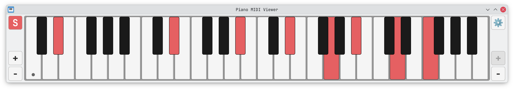

# Piano MIDI Viewer

A virtual piano keyboard that displays MIDI input in real-time. Built for music education, online lessons, and video content.


## Features

- 🎹 **MIDI input** — real-time key visualization
- 🖱️ **Mouse support** — click and drag to highlight keys
- 🔠 **Key labels** — note names, octave numbers, sharps & flats
- 👇 **Show on press** — display labels only on active keys
- 🎨 **Custom colors** — with automatic text contrast
- 🎵 **Sustain** — via pedal, Shift key, or S button
- ↔️ **Octave range** — adjustable from A0 to C8

## Screenshots

### Default


### Examples


*Arch Blue (default), 2 octaves, showing sharps*



*Red, 4 octaves, labels shown only when pressed*


*Teal, 2 octaves, showing both sharps and flats*

### Settings


*MIDI device, colors, and display options*

## Download

Go to [Releases](https://codeberg.org/skoomabwoy/piano-midi-viewer/releases) and download the standalone app for your system:

| Platform | Download | Notes |
|----------|----------|-------|
| **Windows** | `PianoMIDIViewer.exe` | Double-click to run |
| **Linux** | `PianoMIDIViewer` | Make executable, then run (see below) |

**No installation required.** Just download and run.

### Linux: First Run

After downloading, make the file executable (one-time):

```bash
chmod +x PianoMIDIViewer
./PianoMIDIViewer
```

Or right-click the file → Properties → Permissions → "Allow executing as program"

<details>
<summary><b>Alternative: Run from source</b></summary>

If you prefer running from source (requires Python 3.8+):

```bash
git clone https://codeberg.org/skoomabwoy/piano-midi-viewer.git
cd piano-midi-viewer
python -m venv venv
source venv/bin/activate
pip install -r requirements.txt
python piano_viewer.py
```

</details>

## Usage

| Control | Action |
|---------|--------|
| **⚙️ Settings** | MIDI device, colors, display options |
| **S button** | Toggle sustain (sticky) |
| **+/− buttons** | Add/remove octaves |
| **Click** | Highlight key (toggle with sustain) |
| **Drag** | Glissando — paint or erase notes |
| **Shift** | Hold for temporary sustain |
| **MIDI pedal** | Sustain (CC 64) |

## Technical Details

| | |
|-|-|
| Architecture | Single file (`piano_viewer.py`, ~2100 lines) |
| Framework | PyQt6, python-rtmidi |
| Font | JetBrains Mono (embedded) |
| MIDI range | A0–C8 (notes 21–108) |
| Polling | 10ms (100Hz) |

## Changelog

See [releases](https://codeberg.org/skoomabwoy/piano-midi-viewer/releases) for full history.

**6.3.1** — Cross-platform UI consistency (SVG icons, JetBrains Mono buttons)
**6.3.0** — Linux standalone app (no Python required)
**6.2.0** — Windows standalone .exe
**6.1.0** — Show labels only when pressed
**6.0.0** — Key labels (note names, octaves, accidentals)
**5.0.0** — Mouse support, sustain modes

## License

GPL-3.0 — See [LICENSE](LICENSE)

## Development

See [CLAUDE.md](CLAUDE.md) for architecture docs.

---

Contributions welcome.
